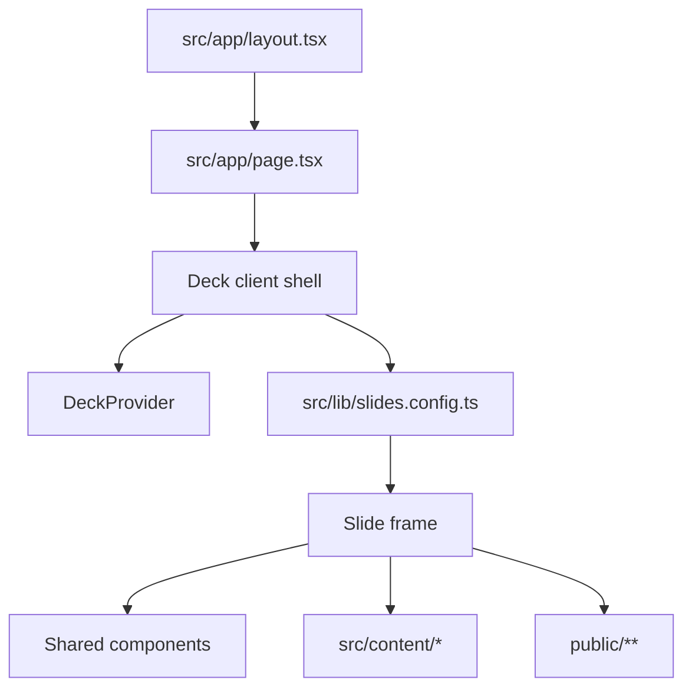
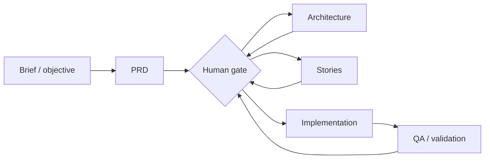

# pres-deck-cvt Deck Architecture

## 1. Scope

`pres-deck-cvt` is a deck-first Next.js 16 application. The product in this repository is the presentation itself: a single projection-safe deck for the CVT, not a CMS, not a workflow product, and not a backend platform.

The architecture therefore optimizes for:

- one local-first presentation runtime;
- one canonical slide registry;
- reusable shared slide primitives;
- file-backed content that is easy to review in Git;
- honest fallback behavior while proof assets are still incomplete;
- a clear implementation path from 6 delivered slides to the planned 39-slide deck.

## 2. Current Runtime Summary

The running application is intentionally narrow:



What exists today:

- `src/app/layout.tsx` defines document metadata, viewport, global fonts, and the full-screen body shell.
- `src/app/page.tsx` exposes a single route and mounts the deck inside `Suspense`.
- `src/components/deck/Deck.tsx` registers hotkeys, renders one active slide at a time, and overlays progress, overview, and black-screen layers.
- `src/components/deck/DeckProvider.tsx` derives the active slide from `?slide=` and owns overview and black-screen UI state.
- `src/lib/slides.config.ts` is the canonical registry for all 39 slides.
- Slides `01` to `06` are implemented as concrete components.
- Slides `07` to `39` are still registered through `makePlaceholderSlide(...)`.

There is no dedicated backend, no runtime database, and no authentication on the live presentation path.

## 3. Presentation Shell

### 3.1 Route and navigation model

The deck uses a single public route: `/`.

Navigation state is encoded in the bounded query parameter `?slide=`:

- absent or invalid value -> slide 1;
- valid numeric value -> clamped to `[1..39]`;
- deep links remain stable because slide identity is controlled centrally in `slides.config.ts`.

This model is appropriate for a presentation because it keeps the URL shareable for rehearsal, while avoiding route-per-slide complexity.

### 3.2 Shell responsibilities

| Module | Responsibility | Notes |
| --- | --- | --- |
| `src/app/layout.tsx` | global document shell | fonts, metadata, viewport, full-screen body styling |
| `src/app/page.tsx` | deck entry point | wraps `Deck` in `Suspense` because search-param-driven client state is used |
| `src/components/deck/Deck.tsx` | presentation shell | hotkeys, fullscreen toggle, active slide mount, progress, overview, black screen |
| `src/components/deck/DeckProvider.tsx` | runtime state | current slide index, overview state, black-screen state, query param sync |
| `src/components/deck/Slide.tsx` | frame primitive | consistent 16:9 shell, chrome, transition, eyebrow, slide number |
| `src/components/deck/SlideOverview.tsx` | overview grid | chapter-aware jump navigation |
| `src/components/deck/SlideProgress.tsx` | presenter progress dock | part indicator, title, progress bar, current/total |
| `src/components/deck/BlackScreen.tsx` | hard blackout layer | keyboard-triggered visual pause for live speaking |

### 3.3 Presentation constraints enforced by the shell

- Only one slide component is mounted as the active slide at a time.
- The deck frame keeps a fixed `16 / 9` aspect ratio and scales to viewport bounds.
- Hotkeys are presentation-first:
  - `Right`, `Space`, `PageDown` -> next
  - `Left`, `PageUp` -> previous
  - `Home`, `End` -> first/last
  - `Esc` -> overview toggle
  - `B` -> black screen
  - `F` -> fullscreen
  - `1..9` -> quick jump to slides 1 to 9
- Background atmosphere, glass panels, grid overlays, and motion are global design language, not slide-specific hacks.

## 4. Canonical Slide Registry

`src/lib/slides.config.ts` is the source of truth for:

- slide order;
- slide identity;
- part/chapter assignment;
- title shown in the progress dock and overview;
- the component mounted for each slide.

Current registry shape:

```ts
export type SlideMeta = {
  id: number;
  part: 1 | 2 | 3 | 4 | 5 | 6 | 7;
  partLabel: string;
  title: string;
  component: ComponentType;
};
```

Registry rules:

1. Slide IDs are stable and never inferred from filenames.
2. New production slides replace placeholder registrations in place; they do not reorder the deck.
3. Shared content must be read by slide components, not duplicated across multiple slide files.
4. `makePlaceholderSlide(...)` is transitional scaffolding only.

## 5. Module Ownership

| Boundary | Owns | Must not own |
| --- | --- | --- |
| `src/app` | route shell, metadata, global styles | narrative facts, slide ordering |
| `src/components/deck` | runtime navigation and frame behavior | business claims, metrics content |
| `src/components/slides` | visual composition of one slide | canonical slide order, cross-deck state |
| `src/components/shared` | reusable visual blocks and chart-like primitives | URL state, chapter navigation |
| `src/content` | typed reusable narrative data | browser interaction logic |
| `public` | approved static visual assets | sensitive raw captures, draft-only material |
| `docs` and `plans` | planning, editorial rules, source intent | presentation runtime data |

## 6. Shared Components

The deck already has a small but meaningful primitive library. These components define the visual language that future slides must reuse.

| Component | Role in the deck | Current usage |
| --- | --- | --- |
| `Slide` | shared slide frame with transition, eyebrow, and numbering | every implemented slide and placeholders |
| `IndustrialPanel` | default glass-panel container | all implemented slides |
| `MetricCard` | standardized metric presentation with trend and estimate/source labeling | slide 4 |
| `LevelCard` | maturity-level card in compact or full variant | `MaturityOverview` |
| `MaturityOverview` | pre-composed slide block for the five-level overview | slide 6 |
| `MaturityPositioningBoard` | maturity comparison board with trajectory lines | slide 5 |
| `SectionEyebrow` | reusable section header primitive | available, not yet widely used |

Architectural intent:

- future slides should be built by composition from these primitives or from new primitives added under `src/components/shared`;
- slide-local layout is allowed, but repeated narrative UI patterns should be promoted into `shared` quickly;
- no future slide should recreate its own alternate shell outside `Slide`.

## 7. Content Sources

### 7.1 Runtime content that already exists

| Source | Purpose | Current consumers |
| --- | --- | --- |
| `src/content/levels.ts` | single source of truth for the 5 maturity levels | slide 6 and future slides 7 to 14 |
| `src/content/metrics.ts` | market metrics and D2R2 metrics with estimate labeling | slide 4 and future slides 16 to 23, 33 |
| slide-local constant arrays in `01-cover.tsx` to `05-positioning.tsx` | presentational copy tightly coupled to a single slide | slides 1 to 5 |
| `public/aot-academy-logo.png` | current approved deck-specific brand asset | slide 1 |

### 7.2 Non-runtime editorial inputs

These files inform implementation but are not part of the presentation runtime:

- `docs/prd.md`
- `plans/deck-plan.md`
- `docs/design-system.md`
- `docs/ux-flows.md`
- `docs/security-rules.md`
- `docs/threat-model.md`

They should continue to shape implementation decisions, but slide components must consume file-backed runtime data from `src/content/*` or `public/**`, not import planning prose directly.

### 7.3 Content source strategy for the unfinished deck

The missing sections should remain file-backed and deck-first:

| Section | Preferred source shape |
| --- | --- |
| maturity deep-dives, tools, practices | extend `src/content/levels.ts` or add adjacent typed modules such as `src/content/practices.ts` |
| D2R2 proof slides | add a dedicated typed proof manifest such as `src/content/proof.ts` and pair it with sanitized assets in `public/**` |
| BMAD and LangGraph slides | add a typed governance narrative module such as `src/content/governance.ts` for stages, gates, and talking points |
| AI pole proposal | add a typed proposition module such as `src/content/pole.ts` for mission, pillars, roadmap, and KPIs |
| demo framing and closure | add typed presenter-support modules such as `src/content/demo.ts` and `src/content/closing.ts` |

The principle is simple: reusable claims and structured evidence move into `src/content/*`; highly local ornamental copy can stay in the slide file.

## 8. Fallback Assets and Honest Proof Strategy

The repository already shows three active fallback patterns that must remain architectural rules:

### 8.1 Placeholder slides are a runtime-safe scaffold

Slides `07` to `39` are not blank pages. They are wrapped in a branded placeholder frame that:

- preserves chapter and slide numbering;
- keeps the deck navigable from start to finish;
- makes missing work explicit instead of hiding it.

This is acceptable during production, but placeholders are not a presentation-ready endpoint.

### 8.2 Metrics can be estimated, but only if labeled

`src/content/metrics.ts` already carries `isEstimate`, and `MetricCard` renders that distinction. This is the correct pattern for D2R2 proof slides as well:

- confirmed values stay source-linked;
- estimated values stay visibly marked;
- pending values must not be presented as established proof.

### 8.3 Missing proof assets must degrade to explicit summaries

The repo does not yet contain the expected D2R2 screenshot pack. Until those assets exist:

- use labeled fallback summary cards;
- use sanitized static exports only;
- never imply that a screenshot or metric exists when it does not;
- keep the narrative intelligible without the live demo.

### 8.4 Current asset inventory

| Asset path | Status | Architectural use |
| --- | --- | --- |
| `public/aot-academy-logo.png` | approved runtime asset | cover slide branding |
| `public/file.svg`, `public/globe.svg`, `public/next.svg`, `public/vercel.svg`, `public/window.svg` | legacy starter assets | not part of the deck narrative and should not be treated as proof assets |
| future D2R2 screenshots under `public/**` | pending | must be sanitized and paired with explicit source/provenance notes |

Recommended target organization once evidence assets arrive:

```text
public/
  branding/
  evidence/
    d2r2/
  diagrams/
```

That target structure does not exist yet, but it is the preferred landing zone for future runtime-safe proof assets.

## 9. Slide Register

The table below documents the real state of the deck and the intended source of truth for each slide.

| # | Part | Title | Status | Runtime component | Current or target content source |
| --- | --- | --- | --- | --- | --- |
| 1 | P1 | Le développement agentique à AOT | implemented | `01-cover.tsx` | slide-local copy + `public/aot-academy-logo.png` |
| 2 | P1 | Sommaire | implemented | `02-summary.tsx` | slide-local section summary model |
| 3 | P1 | Qui je suis | implemented | `03-whoami.tsx` | slide-local stance and evidence summary |
| 4 | P1 | Le constat — ce qui a changé en 18 mois | implemented | `04-constat.tsx` | `MARKET_METRICS` + slide-local flow/decision copy |
| 5 | P1 | Où en est AOT ? Où devrait-on être ? | implemented | `05-positioning.tsx` | slide-local rows + `MaturityPositioningBoard` |
| 6 | P2 | Vue d'ensemble — 5 niveaux de maturité | implemented | `06-maturity.tsx` | `MATURITY_LEVELS` via `MaturityOverview` |
| 7 | P2 | N1 — Chat | placeholder | `makePlaceholderSlide(7, ...)` | future concrete slide sourced from `MATURITY_LEVELS[0]` |
| 8 | P2 | N2 — Copilote | placeholder | `makePlaceholderSlide(8, ...)` | future concrete slide sourced from `MATURITY_LEVELS[1]` |
| 9 | P2 | N3 — Agent guidé | placeholder | `makePlaceholderSlide(9, ...)` | future concrete slide sourced from `MATURITY_LEVELS[2]` |
| 10 | P2 | Zoom N3 : les outils | placeholder | `makePlaceholderSlide(10, ...)` | future tools module plus shared cards/boards |
| 11 | P2 | Zoom N3 : les pratiques | placeholder | `makePlaceholderSlide(11, ...)` | future practices module plus shared comparison blocks |
| 12 | P2 | N4 — Human in the Loop | placeholder | `makePlaceholderSlide(12, ...)` | future concrete slide sourced from `MATURITY_LEVELS[3]` |
| 13 | P2 | Zoom N4 : BMAD + LangGraph | placeholder | `makePlaceholderSlide(13, ...)` | future governance narrative module and diagram primitive |
| 14 | P2 | N5 — Swarm | placeholder | `makePlaceholderSlide(14, ...)` | future concrete slide sourced from `MATURITY_LEVELS[4]` |
| 15 | P2 | Positionnement — Marché / EDF / AOT / Cibles | placeholder | `makePlaceholderSlide(15, ...)` | future positioning dataset plus `MaturityPositioningBoard` |
| 16 | P3 | D2R2 en 1 slide | placeholder | `makePlaceholderSlide(16, ...)` | future proof manifest and summary panels |
| 17 | P3 | Workflow mis en place | placeholder | `makePlaceholderSlide(17, ...)` | future workflow model plus diagram/fallback panel |
| 18 | P3 | Diagramme — du ticket au PR | placeholder | `makePlaceholderSlide(18, ...)` | future flow diagram plus proof annotations |
| 19 | P3 | Exemple réel : un bead | placeholder | `makePlaceholderSlide(19, ...)` | future sanitized screenshot or explicit fallback summary |
| 20 | P3 | Exemple réel : un plan d'implémentation | placeholder | `makePlaceholderSlide(20, ...)` | future sanitized plan capture or rebuilt summary card |
| 21 | P3 | Exemple réel : un recap + LEARNED | placeholder | `makePlaceholderSlide(21, ...)` | future recap artifact or fallback summary card |
| 22 | P3 | Métriques D2R2 | placeholder | `makePlaceholderSlide(22, ...)` | `D2R2_METRICS` with estimate labels |
| 23 | P3 | Apprentissages clés | placeholder | `makePlaceholderSlide(23, ...)` | future lessons subset from proof manifest |
| 24 | P4 | Pourquoi N4 ? | placeholder | `makePlaceholderSlide(24, ...)` | future governance narrative module |
| 25 | P4 | BMAD en 1 schéma | placeholder | `makePlaceholderSlide(25, ...)` | future BMAD stages dataset plus diagram primitive |
| 26 | P4 | LangGraph : validation gates | placeholder | `makePlaceholderSlide(26, ...)` | future gates dataset plus flow primitive |
| 27 | P4 | Exemple concret de workflow | placeholder | `makePlaceholderSlide(27, ...)` | future governed end-to-end sequence with human gates |
| 28 | P4 | Retours d'expérience | placeholder | `makePlaceholderSlide(28, ...)` | future field lessons and trade-off cards |
| 29 | P5 | Pourquoi un pôle IA maintenant | placeholder | `makePlaceholderSlide(29, ...)` | future proposition module |
| 30 | P5 | Mission & positionnement | placeholder | `makePlaceholderSlide(30, ...)` | future proposition module |
| 31 | P5 | Les 4 piliers | placeholder | `makePlaceholderSlide(31, ...)` | future proposition module |
| 32 | P5 | Roadmap T0 → T+12 mois | placeholder | `makePlaceholderSlide(32, ...)` | future roadmap dataset and timeline primitive |
| 33 | P5 | KPIs & mesures de succès | placeholder | `makePlaceholderSlide(33, ...)` | future proposition KPIs plus labeled estimates |
| 34 | P5 | Comment rejoindre / contribuer | placeholder | `makePlaceholderSlide(34, ...)` | future contribution-path content |
| 35 | P6 | Transition démo | placeholder | `makePlaceholderSlide(35, ...)` | future demo framing module |
| 36 | P6 | Démo live Claude Code | placeholder | `makePlaceholderSlide(36, ...)` | future live anchor with explicit fallback path |
| 37 | P6 | Retour démo | placeholder | `makePlaceholderSlide(37, ...)` | future recap module tied to the demo learning outcome |
| 38 | P7 | Prochaines étapes + appel à action | placeholder | `makePlaceholderSlide(38, ...)` | future closing module |
| 39 | P7 | Q&A + ressources + contact | placeholder | `makePlaceholderSlide(39, ...)` | future closing module and speaker resources |

## 10. Local-First Runtime

The runtime must stay local-first because the product is designed for live projection.

Required properties:

- the main route renders without calling a remote API;
- no database connection is needed to browse the deck;
- no authentication redirect is needed to start the talk;
- the deck remains comprehensible if the live demo is shortened or skipped;
- approved assets are bundled with the app and available in a local build.

This is already reflected in the current implementation:

- all runtime content comes from local TypeScript modules or static assets;
- fullscreen is controlled directly in the browser;
- navigation state is derived from the URL only;
- the slide shell is self-contained inside the app bundle.

## 11. Projection-Safe Runtime Rules

The following runtime rules are non-negotiable for future slide work:

1. Keep all slide content legible at projection distance.
2. Prefer deterministic panels, boards, and diagrams over scroll-heavy layouts.
3. Budget animations for slide transitions and emphasis only.
4. Avoid introducing any slide that requires network timing or third-party scripts.
5. Keep proof assets cropped, sanitized, and lightweight.
6. Keep the deck usable from keyboard only.
7. Ensure every demo-critical claim also has a prepared non-live explanation.

## 12. Governed Level-4 Narrative Model

US-012 is not asking for process documentation. It is asking for a slide-ready explanation of why level 4 exists and how it differs from level 3.

The architecture framing for Part 4 is:

- Level 3 = one operator steering one strong agent repeatedly.
- Level 4 = multiple specialized stages linked together with explicit validation gates.
- BMAD provides stage decomposition.
- LangGraph provides controlled transitions and gateable flow.
- Human control moves from constant prompting to explicit approvals at the right checkpoints.

Slide-ready sequence:



Narrative rule:

- Part 4 exists to explain governed scale-up from a proven N3 baseline.
- It must never imply that orchestration is the product itself.

## 13. Implementation Rules

To keep the deck coherent while slides 7 to 39 are implemented:

1. Replace placeholder registrations with concrete slide components in `slides.config.ts` one by one.
2. Keep slide IDs, titles, and chapter assignments stable unless the deck plan changes explicitly.
3. Promote reusable narrative structures into `src/components/shared/*`.
4. Promote reusable facts, metrics, evidence metadata, and roadmap structures into `src/content/*`.
5. Keep `public/**` limited to sanitized, reviewable runtime assets.
6. Do not add remote dependencies to the main presentation path.

## 14. Architecture Assessment

Status: ready for implementation review.

This architecture is intentionally conservative because the repository already tells a clear story:

- one deck;
- one shell;
- one slide registry;
- reusable visual primitives;
- typed file-backed content;
- explicit fallbacks while the proof pack is still incomplete.

That is the right architecture for the product that actually exists in this repo.
