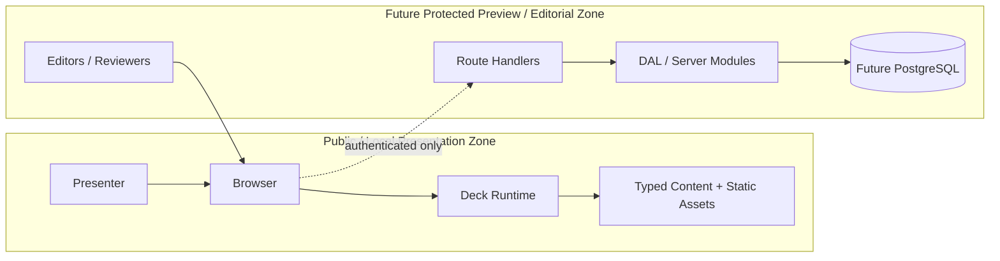

# pres-deck-cvt Threat Model

## 1. Objective

This document models security threats for `pres-deck-cvt`, a deck-first Next.js application designed for local rehearsal and projection-safe live presentation. The goal is not to harden a generic SaaS product. The goal is to keep the presentation path trustworthy, prevent avoidable data exposure during demos, and define safe rules for any future protected preview or editorial features.

## 2. Scope

In scope:

- the public or local presentation route served by `src/app/page.tsx`;
- client-side deck controls managed by `Deck` and `DeckProvider`;
- typed in-repo content and static assets used by slides;
- optional future Route Handlers under `src/app/api/**`;
- optional future protected preview and editorial workflows.

Out of scope for the MVP:

- multi-tenant collaboration;
- arbitrary user content authoring;
- direct database-backed presentation rendering;
- custom production identity platform work for the live deck path.

## 3. System Summary

The current architecture has a deliberately narrow runtime:

- the browser loads one Next.js application;
- the deck shell reads a bounded `?slide=` query parameter for navigation;
- slide order is fixed in `src/lib/slides.config.ts`;
- content is primarily bundled from typed modules under `src/content/*`;
- static assets are served from `public/**`;
- future APIs and persistence are explicitly off the critical presentation path.

This gives the project a small current attack surface, but it also creates a clear future split:

- a low-risk public presentation zone;
- a higher-risk protected preview/editorial zone that must not contaminate the public deck path.

## 4. Security Objectives

1. Preserve presentation integrity.
   The speaker must show the intended slide sequence and approved content without unauthorized mutation.

2. Preserve demo safety.
   The live demo must not require secrets, privileged access, or unstable external dependencies in front of the audience.

3. Prevent accidental disclosure.
   Screenshots, metrics, code snippets, and future evidence assets must not leak private data or credentials.

4. Keep optional protected features isolated.
   Future auth, APIs, and persistence must be additive and must fail away from the live presentation route.

5. Maintain recoverability.
   If a future dependency fails, the deck must fall back to safe local content, screenshots, or prepared summary slides.

## 5. Assets to Protect

| Asset | Why it matters |
| --- | --- |
| Slide registry (`slides.config.ts`) | Canonical order and identity of the 39-slide deck |
| Typed narrative content (`src/content/*`) | Holds claims, metrics, maturity framing, and future evidence metadata |
| Static assets (`public/**`) | Can leak sensitive information if screenshots are not sanitized |
| Presenter controls and navigation state | Must stay predictable during a live talk |
| Future protected APIs | Would expose editorial or rehearsal data if misconfigured |
| Future secrets and credentials | Must never enter the client bundle or slide content |
| Evidence approval history | Needed for auditability once protected workflows exist |

## 6. Actors

| Actor | Trust level | Notes |
| --- | --- | --- |
| Presenter | Trusted operator | Runs the deck locally or in protected preview |
| Audience | Untrusted observer | Can see the screen and, in remote preview cases, the public route |
| Maintainer | Trusted contributor | Can change slide content, assets, and code |
| Future editor/reviewer | Conditionally trusted | Should only access protected preview or editorial features |
| Anonymous internet user | Untrusted | Relevant only when remote previews or APIs are exposed |

## 7. Entry Points

Current entry points:

- `GET /` for the main deck route;
- `?slide=` query parameter handled in `DeckProvider`;
- keyboard and fullscreen interactions in the browser;
- static asset requests under `public/**`.

Future entry points:

- `src/app/api/**` Route Handlers;
- protected route groups such as `src/app/(protected)/**`;
- future auth sign-in/sign-out endpoints;
- future evidence upload or rehearsal submission endpoints.

## 8. Trust Boundaries

Primary trust boundaries:

- browser input into client navigation state;
- repository-managed content into slide rendering;
- future authenticated traffic into Route Handlers;
- future secrets and database access into server-only modules.

## 9. Assumptions

- The MVP deck is usable without authentication.
- The live presentation path remains local-first and does not require remote APIs.
- The current `?slide=` parameter is numeric, bounded, and used only for navigation.
- Slide rendering does not accept arbitrary user HTML.
- Any future protected zone will be implemented with server-side authorization checks near the data boundary.

## 10. STRIDE Analysis

| STRIDE | Threat scenario | Impact | Current exposure | Required mitigation |
| --- | --- | --- | --- | --- |
| Spoofing | A remote preview is exposed without platform protection and is mistaken for an internal-only review environment. | Unauthorized viewers access preview material or protected evidence. | Future risk | Require host-level preview protection first; add server-side session checks for any protected route group. |
| Spoofing | Future editorial actions rely only on client state or layout checks. | A user reaches protected actions without a valid session. | Future risk | Enforce authorization in Route Handlers and DAL/server modules; never trust client-side route gating. |
| Tampering | A contributor inserts unreviewed or misleading evidence into `src/content/*` or `public/**`. | Deck credibility is damaged during presentation. | Current risk | Use approved evidence lists, code review, and content ownership rules; track evidence status when `evidence.ts` is introduced. |
| Tampering | Future external text or evidence metadata is rendered without sanitization. | XSS or content corruption in slide rendering or preview tooling. | Future risk | Sanitize all external text; forbid raw HTML rendering in slides; prefer plain text DTOs. |
| Tampering | Future APIs allow mutation without CSRF protection or origin checks. | Unauthorized state changes to rehearsal or evidence records. | Future risk | Use same-site cookies if sessions exist, enforce origin checks on mutations, and keep mutation endpoints protected and rate-limited. |
| Repudiation | A reviewer changes evidence approval or rehearsal notes with no audit trail. | No accountability for what was approved for the deck. | Future risk | Add append-only audit events for protected editorial actions and approval changes. |
| Repudiation | Manual asset swaps happen before a talk with no record of provenance. | Difficult to prove which screenshot or metric source was shown. | Current risk | Keep approved evidence in-repo, require source references in content metadata, and review diffs before rehearsal. |
| Information Disclosure | Sensitive screenshots, terminal captures, or metrics are added to `public/**` without redaction. | Confidential data leaks to the audience or internet preview users. | Current risk | Redact screenshots before commit, prefer cropped static assets, and block secrets or internal URLs from published assets. |
| Information Disclosure | Future secrets, tokens, or database credentials are imported into client components. | Secrets leak into the browser bundle. | Future risk | Keep secrets in server-only modules, use environment variables on the server only, and fail builds that import server code into client bundles. |
| Information Disclosure | Remote preview exposes internal notes, evidence rationale, or draft metrics. | Non-public material becomes visible outside the rehearsal team. | Future risk | Split public deck DTOs from protected editorial DTOs and deny draft-only fields on public responses. |
| Denial of Service | The presentation route starts depending on remote APIs, auth redirects, or databases. | Live talk fails when the network or provider is unavailable. | Architectural risk | Keep deck rendering file-backed and offline-capable; treat remote preview features as optional and degradable. |
| Denial of Service | Oversized images, heavy animations, or expensive syntax rendering degrade presentation performance. | Jank, slow transitions, or browser crashes during projection. | Current risk | Budget asset sizes, pre-render heavy examples where possible, and verify with local build and rehearsal hardware. |
| Denial of Service | Future public APIs are left without rate limiting. | Preview service or protected features become unstable. | Future risk | Prefer host-level rate limiting and low-complexity endpoints; keep APIs off the deck runtime critical path. |
| Elevation of Privilege | Future protected routes share modules with public slides and accidentally expose privileged data paths to the client. | Unauthorized access to editorial or database-backed data. | Future risk | Separate `src/lib/server` and `src/lib/dal` modules from client code; never import server modules into slide components. |
| Elevation of Privilege | An editor gains broader access than intended because roles are not enforced at the data boundary. | Unauthorized evidence or rehearsal management actions. | Future risk | Define least-privilege roles and check them in DAL/Route Handlers for every mutation and sensitive read. |

## 11. Highest-Priority Risks

### R1. Sensitive evidence leakage through screenshots or assets

This is the most plausible current failure mode because the deck is evidence-heavy and relies on static assets. A single unredacted screenshot can disclose internal URLs, names, emails, tokens, or metrics.

Mitigation priority:

- require pre-commit asset review for every screenshot used in the deck;
- prefer sanitized exports over live captures;
- maintain explicit source and approval notes for future evidence assets.

### R2. Remote dependencies breaking the live deck path

The architecture explicitly avoids this, but it is easy to regress later when preview or rehearsal features arrive.

Mitigation priority:

- no auth handshake on the public presentation route;
- no required database or API read for deck rendering;
- every future remote feature must have a bundled fallback.

### R3. Future protected zone implemented with client-side trust

This is the main structural risk once preview/editorial features are introduced.

Mitigation priority:

- authorize on the server and at the data boundary;
- keep protected DTOs separate from public deck DTOs;
- treat layouts as UX only, not authorization.

### R4. Untrusted content rendered as HTML

Today the content is file-backed, but later imported evidence or notes could introduce scriptable payloads.

Mitigation priority:

- no `dangerouslySetInnerHTML` for evidence or notes;
- sanitize external text at ingestion time and encode by default at render time.

## 12. Recommended Mitigations by Phase

### Immediate for US-004

- Document non-negotiable demo rules for screenshots, secrets, and fallbacks.
- Keep `?slide=` as the only supported public query parameter affecting runtime behavior.
- State explicitly that the main deck route cannot depend on remote auth or APIs.
- Require review of any asset added under `public/**` for redaction and provenance.

### Before any protected preview or editorial work

- Create `server-only` boundaries for secret-bearing modules.
- Introduce protected route groups and server-side session verification.
- Add audit logging for evidence approval and rehearsal submissions.
- Add rate limiting and DTO separation for any new Route Handlers.

### Before storing operational data

- Put database access behind `src/lib/dal` or `src/lib/server`.
- Separate public presentation data from protected editorial metadata.
- Define retention and access rules for rehearsal records and evidence assets.

## 13. Validation Checklist

- `npm run build` succeeds without requiring a database or auth provider.
- The deck renders locally with network disabled for the main route.
- No slide depends on raw user HTML.
- No secrets or internal credentials are present in slide content, screenshots, or client bundles.
- Any future `/api/*` route is absent from the critical presentation path.
- Any future protected route is enforced server-side and audited.

## 14. Residual Risk

The current deck-first architecture keeps the live attack surface small, but the residual risk is mostly operational rather than technical:

- human error when curating screenshots and evidence;
- future preview/editorial shortcuts that erode the public/protected boundary;
- performance regressions introduced by visually rich slides.

These risks are manageable if the security rules in `docs/security-rules.md` are treated as implementation constraints rather than advisory notes.
