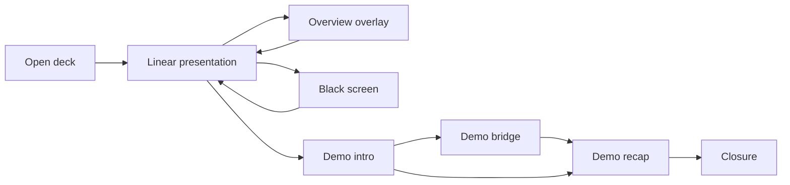
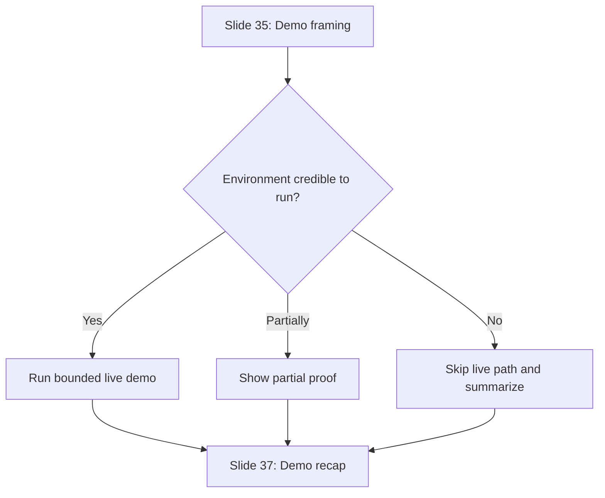

# pres-deck-cvt UX Flows

## 1. Purpose

This document defines the operating flows of the deck as a local-first presentation product.

The primary user is the presenter. The audience judges the product through what the presenter reveals, hides, jumps to, or reframes under pressure. The flows therefore optimize for:

- narrative continuity;
- keyboard-only control;
- fast recovery;
- bounded live-demo risk;
- honest degradation when proof is partial.

## 2. Runtime Model

The current shell is intentionally narrow:

- one public route: `/`;
- one active slide at a time;
- one canonical `?slide=` query parameter for current position;
- one overview overlay;
- one black-screen overlay;
- one persistent progress dock.

This keeps the deck local-first, deep-linkable, and easy to rehearse without adding route or network complexity.

## 3. Actors

### 3.1 Presenter

Owns progression, interruptions, recovery, demo handoff, and closure.

### 3.2 Audience

Experiences the output passively but interprets confidence, clarity, and credibility from every transition.

### 3.3 Optional live-demo environment

This is a conditional proof surface, not the primary product. The deck must frame it before and after use.

## 4. State Model

Interpretation:

- linear presentation is the stable default;
- overview and black screen are short-lived control states;
- the demo is a bounded narrative segment inside the deck, not a second application mode.

## 5. Input Model

The current keyboard contract in `Deck.tsx` is the canonical operating model.

| Input | Current behavior | UX meaning |
| --- | --- | --- |
| `Right`, `Space`, `PageDown` | next slide | default forward rhythm |
| `Left`, `PageUp` | previous slide | immediate recovery |
| `Home` | first slide | restart or reset |
| `End` | last slide | direct jump to closing |
| `Esc` | close overview if open, otherwise open overview | primary non-linear recovery path |
| `B` | toggle black screen | attention reset or masked transition |
| `F` | toggle fullscreen | room setup control |
| `1` to `9` | jump to slides 1 to 9 | absolute quick anchors, not chapter shortcuts |

Important current nuance:

- overview selection uses `goTo()` and clears both overview and black-screen state;
- direct next or previous navigation does not clear black screen, because black screen is an independent overlay;
- numeric keys currently cover only slides `1` to `9`, so later jumps should rely on overview or deep links.

## 6. Flow 1: Deck Launch and Room Setup

### Goal

Get the presenter into a stable presentation state with minimal ceremony.

### Entry

- open `/`;
- open `/?slide=N`;
- refresh while already on a given slide.

### System behavior

1. `DeckProvider` reads `?slide=`.
2. Invalid or missing values clamp safely into valid deck bounds.
3. The route renders the active slide with the shared shell.
4. The progress dock immediately exposes chapter and slide position.

### UX requirements

- no authentication gate;
- no network prerequisite;
- no hidden state required beyond the URL;
- deep-linked entry must still reveal chapter context immediately.

### Success

- the deck is usable from a local build without setup friction;
- rehearsal can resume from a bookmarked slide reliably.

## 7. Flow 2: Standard Linear Presentation

### Goal

Let the presenter deliver the planned 39-slide sequence without needing pointer-driven controls.

### Flow

1. Presenter opens the deck.
2. Presenter advances or rewinds with keyboard controls.
3. Slide transitions confirm change without stealing attention.
4. The progress dock keeps position visible and discreet.
5. The presenter reaches the next narrative segment without tool friction.

### Experience rules

- every slide should be understandable within one screen;
- the dock must orient, not distract;
- the shell should feel invisible once the talk begins.

### Failure to avoid

- navigation ambiguity;
- dense slides that require prolonged silent reading;
- shell chrome competing with narrative content.

## 8. Flow 3: Non-linear Jump During Q&A or Review

### Goal

Allow safe chapter jumps when the presenter needs to answer a question, revisit a proof point, or restart a section.

### Trigger

- audience question;
- speaker needs to revisit a maturity comparison or proof slide;
- rehearsal spot-check.

### Flow

1. Presenter presses `Esc`.
2. Overview overlay opens over the deck.
3. Current slide is highlighted.
4. Presenter selects a target slide from the grid.
5. `goTo()` updates the URL and closes overview.
6. The talk resumes from the selected slide.

### Current implementation details to preserve

- overview cards show part number, chapter label, title, and slide number;
- clicking outside the overview closes it;
- selecting a slide also clears black screen state.

### Guardrails

- overview must feel dependable enough to use live;
- current slide highlight must remain obvious;
- overview is a recovery map, not a browsing experience.

## 9. Flow 4: Attention Reset with Black Screen

### Goal

Temporarily remove the visual field while preserving the presenter’s place in the deck.

### Trigger

- verbal emphasis;
- room interaction;
- short masked transition before or after the demo;
- need to speak without a busy slide behind the speaker.

### Flow

1. Presenter presses `B`.
2. A full-screen black overlay appears.
3. Internal deck state remains intact underneath.
4. Presenter presses `B` again to restore the current slide.

### Current nuance

Because black screen is an independent overlay, the presenter can technically change slides while it is active. This is acceptable as a backstage recovery mechanism, but the documented intended usage is:

1. black screen on;
2. reposition if needed;
3. black screen off;
4. resume speaking.

### Guardrails

- do not treat black screen as a hidden presenter mode;
- do not leave the audience in black for long unexplained stretches;
- use it as a deliberate pause, not as a patch for weak slide structure.

## 10. Flow 5: Deep-Link Rehearsal and Fast Resume

### Goal

Support rehearsal and review through explicit URL state.

### Flow

1. Presenter opens a slide-specific URL such as `?slide=22`.
2. The shell clamps the value into bounds.
3. The target slide renders.
4. Presenter continues linearly or opens overview from there.

### Why this matters

- slide-specific review becomes trivial;
- the presenter can recover after refresh without hunting for position;
- collaborators can reference exact slides without route-per-slide complexity.

### UX rule

Deep links must stay stable because `slides.config.ts` is the canonical slide registry. Slide IDs should not drift casually.

## 11. Flow 6: Demo Framing, Live Path, and Recap

This is the most critical flow for `US-017`.

### Goal

Keep the live-demo segment credible by bounding scope before the live switch, minimizing ambiguity during it, and restoring narrative control immediately after it.

### Target sequence

- slide 35: frame the live segment;
- slide 36: bridge to live proof or fallback;
- slide 37: recap and reconnect the demo to the thesis.

### State diagram

### Step A: Slide 35, demo framing

Required content:

- what the audience is about to see;
- what signal matters most;
- what is intentionally out of scope;
- what fallback will happen if the live path is compressed.

Required interaction contract:

- presenter stays inside the deck while setting expectations;
- this slide is the last stable context before any tool switch;
- the audience should know how to evaluate the demo before it begins.

### Step B: Slide 36, demo bridge

This slide should support three honest operating states.

| State | When to use it | What the slide should communicate |
| --- | --- | --- |
| Live active | environment is stable enough to run | one live objective and one audience lens |
| Partial proof | some assets or commands are usable, but full run is not ideal | representative proof and why it still matters |
| Skipped live | live run would reduce credibility | direct summary of intended lesson and why the demo is being skipped |

Hard rules:

- never improvise new scope mid-demo;
- never turn the segment into a tool tour;
- if friction appears, compress early and move to recap.

### Step C: Slide 37, demo recap

Required recap structure:

- three takeaways maximum;
- one link back to maturity level or governance;
- one statement about operator control, safety, or delivery value;
- optional note about what was actually shown live.

This slide must work even if slide 36 became a fallback summary.

## 12. Honest Fallback Ladder

The deck must remain credible when reality is incomplete.

### 12.1 Evidence fallback

1. use approved real asset if available;
2. otherwise use an estimated metric with an explicit label;
3. otherwise use a planned-capture note with a clear scope statement;
4. otherwise use a direct fallback summary card.

### 12.2 Demo fallback

1. run the bounded live objective if credible;
2. compress to partial proof if the environment is only partly reliable;
3. skip live and recap immediately if credibility would drop.

### 12.3 Navigation fallback

1. open overview if position is unclear;
2. jump to a known anchor slide;
3. use a short verbal bridge;
4. continue linearly.

## 13. Failure and Recovery Patterns

### 13.1 Presenter loses position

Recommended recovery:

1. press `Esc`;
2. identify the correct chapter anchor;
3. jump with overview;
4. resume with one sentence of framing.

### 13.2 Live demo becomes unstable

Recommended recovery:

1. decide quickly whether the issue is temporary or credibility-breaking;
2. if temporary, compress scope immediately;
3. if credibility-breaking, stop the live path;
4. move to recap and extract the intended lesson.

### 13.3 Proof asset is missing

Recommended recovery:

1. do not hide the topic;
2. swap in a labeled summary panel;
3. keep the story moving;
4. preserve honesty about the missing artifact.

### 13.4 Projection or room needs a reset

Recommended recovery:

1. use black screen briefly;
2. adjust position or room attention;
3. restore the slide;
4. continue without narrating the tool mechanics.

## 14. Flow-to-Component Mapping

| Flow | Primary shell components | Notes |
| --- | --- | --- |
| Launch and linear presenting | `Deck`, `DeckProvider`, `Slide`, `SlideProgress` | base deck operation |
| Q&A jump | `SlideOverview` | non-linear recovery |
| Attention reset | `BlackScreen` | visual interruption only |
| Deep-link rehearsal | `DeckProvider` + `slides.config.ts` | URL-based resume |
| Demo framing and recap | `Slide` + `IndustrialPanel` plus future shared demo primitives | content-level flow on top of the shell |

## 15. Acceptance Target

The UX flows are ready when:

- the presenter can run the deck locally without network dependency;
- the keyboard contract is enough for presenting, recovering, and closing;
- non-linear jumps feel intentional instead of improvised;
- the demo segment remains coherent under live, partial, or skipped conditions;
- every fallback path protects the deck’s credibility rather than exposing production gaps.
